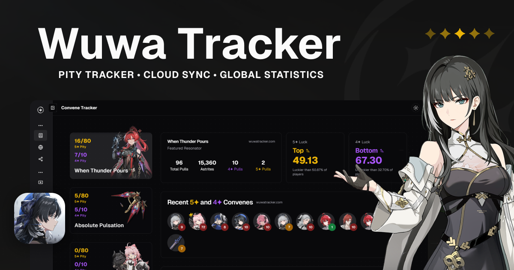

<h1 align="center">
  <a href="https://wuwatracker.tech">
    <picture>
      <source media="(prefers-color-scheme: dark)" srcset="./img/logo-white.png">
      <source media="(prefers-color-scheme: light)" srcset="./img/logo-black.png">
      
    </picture>
  </a>
</h1>

<p align="center">
  <i>A pity counter for Wuthering Waves, using the up-to-date data with global statistics and more. Share your pulls with your friends and track your account!</i><br><br>
  <i>Built with <a href="https://nextjs.org/">Next.js</a> + <a href="https://www.typescriptlang.org/">TypeScript</a>, deployed on <a href="https://vercel.com/">Vercel</a> @ <a href="https://wuwatracker.tech">wuwatracker.tech</a>.</i>
</p>

<h5 align="center">
  <a href="https://discord.gg/mADnEXwZGT">
    
  </a>
  <a href="https://x.com/wuwatracker">
    
  </a>
  <a href="https://www.reddit.com/r/wuwatracker/">
    
  </a>
  <a href="https://ko-fi.com/luzefiru">
    
  </a>
  <br>
  <br>
   <a href="https://opensource.org/licenses/gpl-3.0">
    
  </a>
  <a href="https://github.com/Luzefiru/wuwatracker/deployments/Production">
    
  </a>
</h5>



## Setup

First, run the development server:

```bash
npm install   # installs all dependencies
npm run dev   # runs a development server
```

Open [http://localhost:3000](http://localhost:3000) with your browser to see the result.

## Contributing

We'd love your help in improving the website with features, bug reports, and patches. But before doing so, please;

1. Read our [Contributing Guide](./CONTRIBUTING.md) before making an issue or pull request.
2. [Fork this repository](https://github.com/Luzefiru/wuwatracker/fork) and start working on your own repository before making a pull request.

#### Apply as a Tester

If you're interested in testing new features, head over to our [Discord Server](https://discord.gg/mADnEXwZGT) and read the pinned messages in the `#tester-application` text channel.

### For Feature Requests or Bug Reports

[Create an issue](https://github.com/Luzefiru/wuwatracker/issues/new/choose) while following the specific templates.

## Credits

Thank you to all the Rovers who contributed to this project! May your Convenes be golden evermore.

<a href="https://github.com/Luzefiru/wuwatracker/graphs/contributors">
  
</a>
