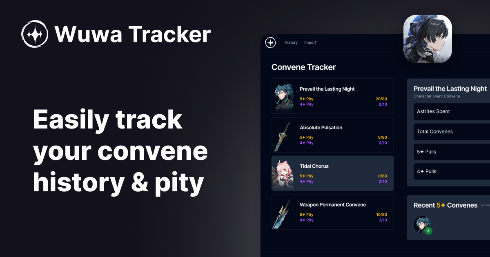

# [wuwatracker.tech](https://wuwatracker.tech)

A pity counter for Wuthering Waves, using the up-to-date data with global statistics and more. Share your pulls with your friends and track your account!

Built with [Next.js](https://nextjs.org/) + [TypeScript](https://www.typescriptlang.org/), deployed on [Vercel](https://vercel.com/) @ [wuwatracker.tech](https://wuwatracker.tech).



## Setup

First, run the development server:

```bash
npm install   # installs all dependencies
npm run dev   # runs a development server
```

Open [http://localhost:3000](http://localhost:3000) with your browser to see the result.

## Contributing

We'd love your help in improving the website with features, bug reports, and patches. But before doing so, please;

1. Read our [Contributing Guide](./CONTRIBUTING.md) before making an issue or pull request.
2. [Fork this repository](https://github.com/Luzefiru/wuwatracker/fork) and start working on your own repository before making a pull request.

### For Feature Requests or Bug Reports

[Create an issue](https://github.com/Luzefiru/wuwatracker/issues/new/choose) while following the specific templates.

## Credits

Thank you to all the Rovers who contributed to this project! May your Convenes be golden evermore.

<a href="https://github.com/Luzefiru/wuwatracker/graphs/contributors">
  
</a>
